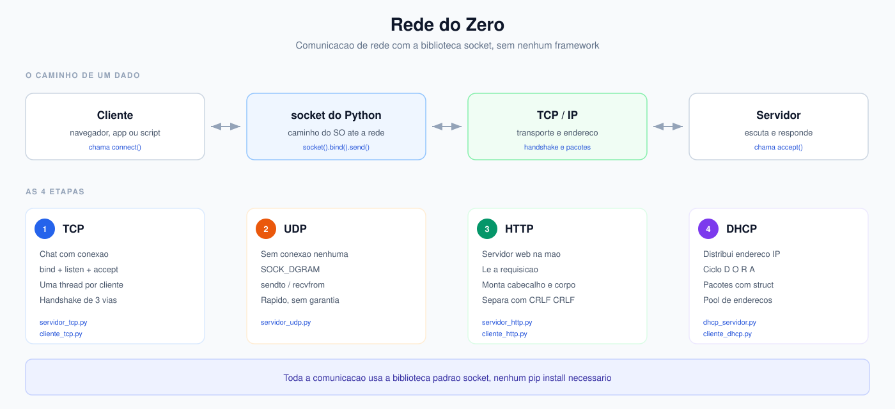
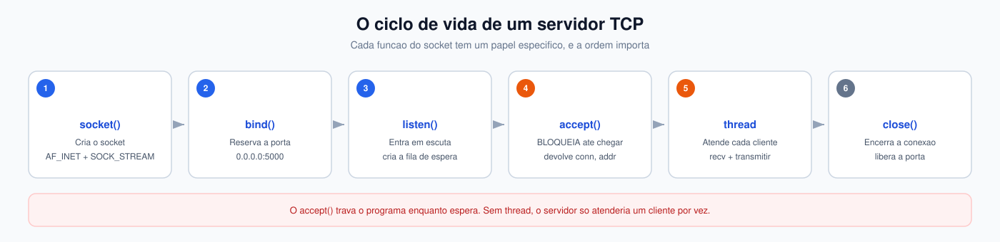
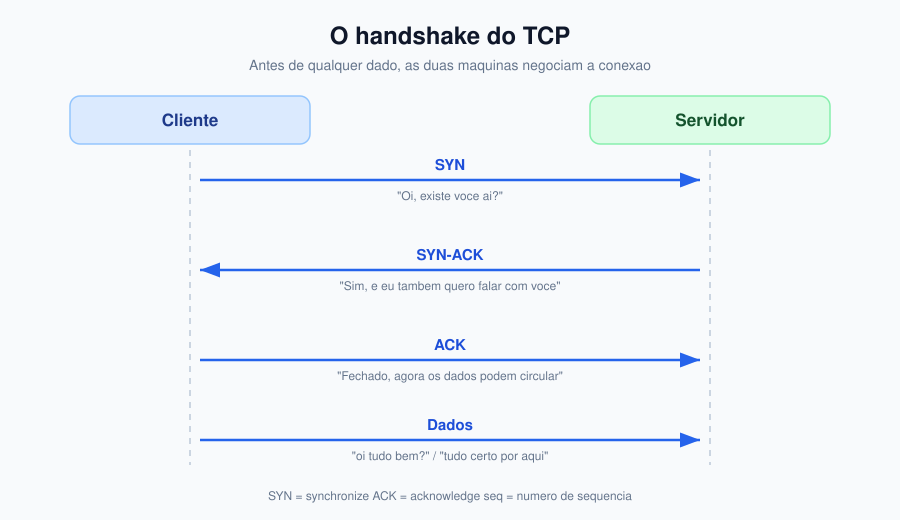
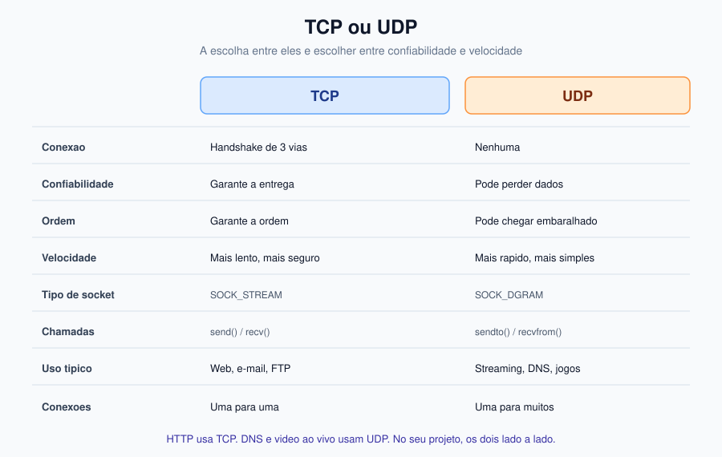
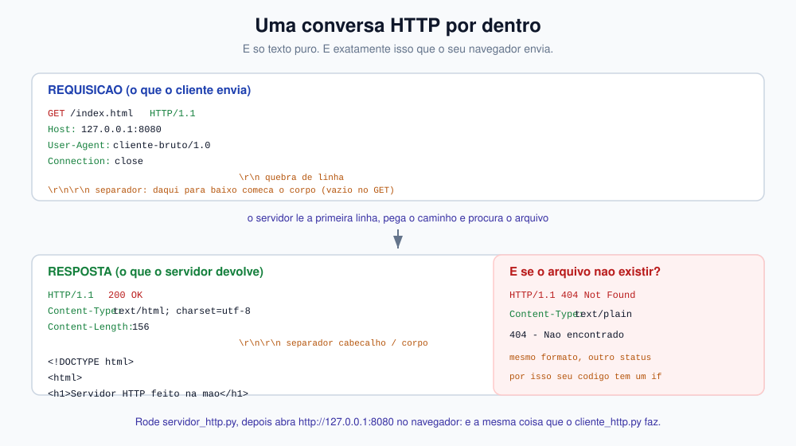
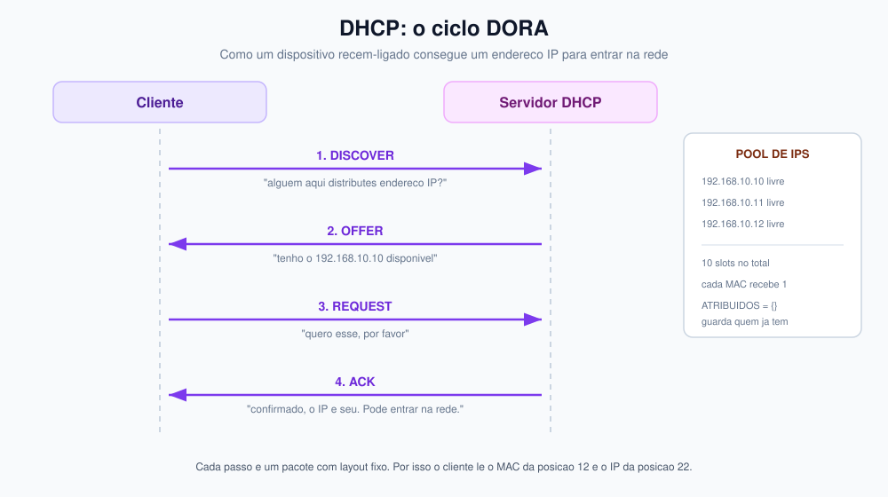
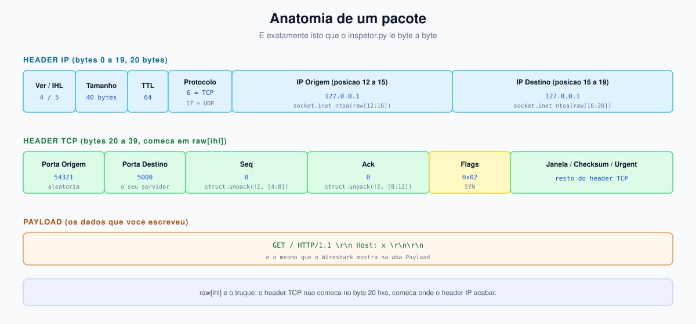
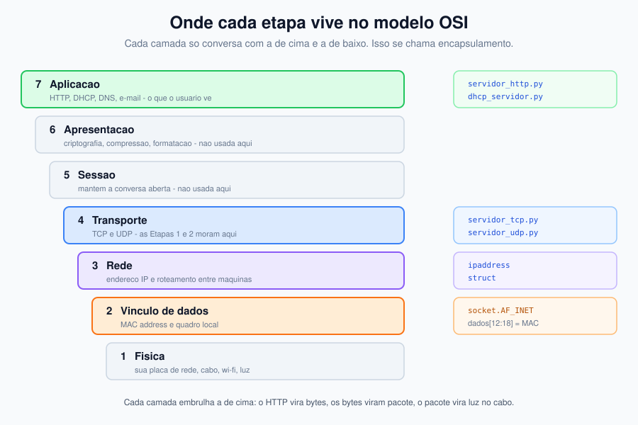

# 🔴 Rede do Zero

Entendendo redes de computador na prática, escrevendo cada protocolo com a própria mão usando apenas a biblioteca `socket` do Python — sem nenhum framework de rede pronto.

Este projeto foi construído como uma progressão de 4 etapas. Cada uma delas ensina uma camada diferente de como a rede realmente funciona por baixo do panos.



---

## 📑 Índice

- [Objetivo](#objetivo)
- [O que é a biblioteca `socket`](#o-que-é-a-biblioteca-socket)
- [Estrutura do projeto](#estrutura-do-projeto)
- [Etapa 1 — Servidor e Cliente TCP](#etapa-1--servidor-e-cliente-tcp)
- [Etapa 2 — UDP sem conexão](#etapa-2--udp-sem-conexão)
- [Etapa 3 — Servidor HTTP na mão](#etapa-3--servidor-http-na-mão)
- [Etapa 4 — DHCP simulado](#etapa-4--dhcp-simulado)
- [Bônus — Inspetor de pacotes](#bônus--inspetor-de-pacotes)
- [Resumo dos comandos usados](#resumo-dos-comandos-usados)
- [Comparativo TCP vs UDP](#comparativo-tcp-vs-udp)
- [Camadas do OSI](#camadas-do-osi)
- [Testes e erros esperados](#testes-e-erros-esperados)
- [Bibliotecas utilizadas](#bibliotecas-utilizadas)
- [Requisitos](#requisitos)
- [Como executar](#como-executar)
- [Próximos passos](#próximos-passos)

---

## 🎯 Objetivo

Entender como funcionam redes de computador na prática, construindo cada protocolo do zero usando apenas a biblioteca `socket` do Python, sem nenhum framework de rede pronto. Cada etapa ensina uma camada diferente:

- **Etapa 1** — TCP: como duas máquinas mantêm uma conversa aberta e confiável
- **Etapa 2** — UDP: o que muda quando não há conexão e nem garantia de entrega
- **Etapa 3** — HTTP: como um navegador vira uma requisição de texto puro na rede
- **Etapa 4** — DHCP: como um dispositivo "pede" um endereço IP para poder participar da rede

---

## 🔌 O que é a biblioteca `socket`

Todo o projeto se apoia em **uma única biblioteca da biblioteca padrão do Python**: `socket`. Ela é a camada mais baixa de comunicação de rede disponível em Python — é literalmente a interface com o sistema operacional.

Quando você chama `socket.socket()`, o Python fala com o SO para abrir um **file descriptor** (um número que o sistema usa para representar a conexão). Todo o resto — TCP, UDP, HTTP, DNS — é construído **em cima** dessa chamada.

### Os 3 elementos de toda conexão

Para qualquer comunicação de rede, são sempre 3 coisas:

| Elemento | O que é | Exemplo neste projeto |
|----------|---------|---------------------|
| **IP** | Endereço lógico de quem é o computador | `127.0.0.1` |
| **Porta** | Número da "porta" lógica dentro do computador | `5000`, `6000`, `8080` |
| **Protocolo** | O tipo de conversa (TCP ou UDP) | `SOCK_STREAM` ou `SOCK_DGRAM` |

### As funções principais da `socket`

| Função | Para que serve |
|-------|----------------|
| `socket()` | Cria o socket, dizendo o protocolo (TCP/UDP) |
| `bind()` | "Reserva" uma porta no computador do servidor |
| `listen()` | Coloca o socket em modo "esperar conexões" |
| `accept()` | Bloqueia até alguém conectar, e devolve a conexão |
| `connect()` | O **cliente** se conecta ao servidor |
| `send()` / `sendall()` | Envia dados |
| `recv()` | Recebe dados |
| `close()` | Encerra a conexão |

### TCP vs UDP: qual `socket()` usar

```python
# TCP — com conexão, confiável, ordem garantida
socket.socket(socket.AF_INET, socket.SOCK_STREAM)

# UDP — sem conexão, sem garantia de entrega, mais rápido
socket.socket(socket.AF_INET, socket.SOCK_DGRAM)
```

`AF_INET` significa "endereço IPv4" (os endereços `192.168.x.x` que você vê no seu roteador).



---

## 📁 Estrutura do projeto

```
rede-do-zero/
│
├── .gitignore              # ignora __pycache__, .venv, .env
├── README.md               # este arquivo
├── requirements.txt        # dependências do projeto
│
├── servidor_tcp.py         # ETAPA 1 — servidor de chat TCP
├── cliente_tcp.py          # ETAPA 1 — cliente do chat TCP
│
├── servidor_udp.py         # ETAPA 2 — servidor e cliente UDP no mesmo arquivo
│
├── servidor_http.py        # ETAPA 3 — servidor HTTP feito à mão
├── cliente_http.py         # ETAPA 3 — cliente HTTP cru, mostra os headers
│
├── dhcp_servidor.py        # ETAPA 4 — servidor DHCP simulado
├── cliente_dhcp.py         # ETAPA 4 — cliente que pede um IP
│
├── inspetor.py             # BÔNUS — lê e interpreta os bytes do pacote
│
├── www/
│   └── index.html          # página servida pelo servidor HTTP
│
└── imagens/                # diagramas usados neste README
    ├── 01-arquitetura.svg      # visão geral do projeto
    ├── 02-tcp-handshake.svg    # as 3 vias do handshake
    ├── 03-fluxo-servidor.svg   # bind, listen, accept, thread
    ├── 04-tcp-vs-udp.svg       # comparativo lado a lado
    ├── 05-http-pacotes.svg     # requisição e resposta HTTP crua
    ├── 06-dhcp-dora.svg        # as 4 etapas do DHCP
    ├── 07-pacote-rede.svg      # anatomia do pacote IP + TCP
    └── 08-osi-camadas.svg      # onde cada etapa vive no OSI
```

---

## Etapa 1 — Servidor e Cliente TCP

### O que é TCP

TCP (**T**ransmission **C**ontrol **P**rotocol) é um protocolo de conexão. Antes de qualquer dado trafegar, as duas máquinas negociam uma **conversa de três passos** chamada *handshake* (aperto de mão):

```
Cliente                          Servidor
   |                                |
   | ------ SYN ------------------> |   "Oi, existe aí?"
   | <----- SYN-ACK --------------- |   "Sim, e eu também!"
   | ------ ACK ------------------> |   "Fechado, vamos conversar"
   |                                |
   | ====== dados ========>         |
   | <==== dados ==========         |
```

Só depois dessa negociação é que os dados começam a circular. É por isso que o TCP é **confiável** (não perde dados) e **ordenado** (entrega na ordem).



### O servidor — `servidor_tcp.py`

O servidor tem 4 responsabilidades:

1. **Cria o socket TCP** (`SOCK_STREAM`)
2. **Faz `bind()`** na porta 5000 — reserva a porta
3. **Faz `listen()`** — entra em modo "aceitar conexões"
4. **Fica em `accept()` num laço** — cada conexão nova vira uma `thread`

```python
server = socket.socket(socket.AF_INET, socket.SOCK_STREAM)
server.setsockopt(socket.SOL_SOCKET, socket.SO_REUSEADDR, 1)
server.bind((HOST, PORT))    # reserva a porta
server.listen()              # começa a escutar
```

**Detalhe importante:** o `accept()` fica **parado esperando**. Por isso usamos `threading` — cada cliente que entra ganha sua própria thread, senão o servidor só atenderia uma pessoa por vez.

### O cliente — `cliente_tcp.py`

O cliente é bem mais simples: `connect()` no lugar de `bind()` + `listen()` + `accept()`.

```python
sock = socket.socket(socket.AF_INET, socket.SOCK_STREAM)
sock.connect((HOST, PORT))   # conecta no servidor
```

Ele também usa `threading` para **receber e enviar ao mesmo tempo** — se não, você ficaria travado esperando uma resposta e nunca conseguiria digitar.

### Sobre os endereços

| Endereço | Onde | Por que |
|----------|------|---------|
| `0.0.0.0` | no **servidor** | Escuta em **todas** as interfaces de rede. Se fosse `127.0.0.1`, ninguém de fora entraria |
| `127.0.0.1` | no **cliente** | Conecta só no **próprio computador** (loopback) |

### Como executar

Rode em **dois terminais separados**, ao mesmo tempo:

```powershell
# Terminal 1
python servidor_tcp.py
```

```powershell
# Terminal 2
python cliente_tcp.py
```

Abra um **terceiro terminal** com outro cliente para ver o broadcast funcionar:

```powershell
python cliente_tcp.py
```

### O que você vê

O terminal do servidor mostra o log de tudo:

```
[+] Entrnou: 127.0.0.1:54321
[+] Conexao estabelecida (SYN/ACK aceito)
```

E as mensagens de **todos** os clientes aparecem para **todos** os outros — esse padrão se chama *broadcast* e é controlado pela função `transmitir()`.

### 📸 Screenshot — Etapa 1

> **Como capturar:** com o servidor rodando no terminal 1 e dois clientes nos terminais 2 e 3, tire o print da tela inteira mostrando os 3 terminais. Ou use `Ctrl+Shift+Alt` e a ferramenta de recorte do Windows.

<!-- 📷 COLE AQUI O PRINT DA ETAPA 1 -->

---

## Etapa 2 — UDP sem conexão

### O que é UDP

UDP (**U**ser **D**atagram **P**rotocol) é o oposto do TCP. Ele **não faz handshake**, não confirma entrega e não garante ordem. Você envia e torce.

Pense na diferença: o TCP é uma **ligação de telefone** (conversa contínua, com "alô?" e "tô te ouvindo"). O UDP é um **grito na rua** (manda, e se não chegou, não chegou).

### As diferenças de código

```python
# TCP — precisa de bind/listen/accept
server = socket.socket(socket.AF_INET, socket.SOCK_STREAM)
server.bind((HOST, PORT))
server.listen()
conn, addr = server.accept()   # espera alguém conectar

# UDP — nada disso. Só manda e recebe
sock = socket.socket(socket.AF_INET, socket.SOCK_DGRAM)
sock.bind((HOST, PORT))
dados, addr = sock.recvfrom(1024)  # já chega quem enviou
```

| | TCP | UDP |
|---|---|---|
| Conexão | Sim (handshake) | Não |
| Confiabilidade | Garante entrega | Pode perder |
| Ordem | Garante ordem | Pode chegar fora de ordem |
| Velocidade | Mais lento (overhead) | Mais rápido |
| Socket | `SOCK_STREAM` | `SOCK_DGRAM` |
| Chamadas | `send` / `recv` | `sendto` / `recvfrom` |
| Uso real | Web, e-mail, transferir arquivos | Streaming, DNS, jogos |



### Como executar

O mesmo arquivo faz os dois papéis, decidido pelo `sys.argv[1]`:

```powershell
# Terminal 1
python servidor_udp.py servidor
```

```powershell
# Terminal 2
python servidor_udp.py "minha mensagem"
```

### Por que existe `sys.argv[1]`

`sys.argv` é a **lista de argumentos** passados na linha de comando. Quando você roda:

```powershell
python servidor_udp.py servidor
```

o Python entende:

| Posição | Valor | Significado |
|---------|-------|-------------|
| `sys.argv[0]` | `servidor_udp.py` | Nome do próprio script |
| `sys.argv[1]` | `servidor` | Primeiro argumento depois do script |
| `sys.argv[2]` | *(vazio)* | Segundo argumento, se houver |

Então `if len(sys.argv) > 1 and sys.argv[1] == "servidor"` significa: "se o usuário passou a palavra `servidor`, roda o servidor".

### 📸 Screenshot — Etapa 2

<!-- 📷 COLE AQUI O PRINT DA ETAPA 2 -->

---

## Etapa 3 — Servidor HTTP na mão

### O que é HTTP

HTTP (**H**yper**T**ext **T**ransfer **P**rotocol) é o protocolo que seu navegador usa para falar com sites. Ele roda **em cima do TCP** — é uma conversa com regras de texto bem definidas.

Toda resposta HTTP tem o formato:

```
HTTP/1.1 200 OK
Content-Type: text/html; charset=utf-8
Content-Length: 156

<!DOCTYPE html>
<html>...
```

E toda requisição parece com isso:

```
GET /index.html HTTP/1.1
Host: 127.0.0.1:8080
User-Agent: cliente-bruto/1.0
Connection: close
```

Repare: **é só texto puro**. Nada de biblioteca. É exatamente isso que o navegador faz quando você digita uma URL.



### O servidor — `servidor_http.py`

Este é o mais interessante, porque implementa a lógica real de um servidor web:

**1. Lê a requisição e extrai o caminho**

```python
bruto = conn.recv(4096).decode("utf-8")
partes = bruto.splitlines()[0].split()   # "GET /index.html HTTP/1.1"
caminho = partes[1]                      # "/index.html"
```

**2. Decide o que responder com base no caminho**

```python
if caminho == "/":
    arquivo = "index.html"
else:
    arquivo = caminho.lstrip("/")
```

**3. Monta a resposta com o cabeçalho correto**

```python
if caminho não existe:
    status = "404 Not Found"
else:
    status = "200 OK"
```

**4. Monta e envia os bytes**

```python
cabecalho = f"HTTP/1.1 200 OK\r\nContent-Type: {tipo}\r\nContent-Length: {len(corpo)}\r\n\r\n"
conn.sendall(cabecalho.encode() + corpo)
```

> **Detalhe do `\r\n\r\n`:** esse é o **separador** entre cabeçalho e corpo. Todo protocolo baseado em texto (HTTP, SMTP, FTP) usa `\r\n` como quebra de linha e **duas linhas em branco** para separar cabeçalho de corpo. É por isso que o `cliente_http.py` faz `partition(b"\r\n\r\n")`.

**5. Segurança contra path traversal**

O servidor verifica que o caminho não sai da pasta `www/`:

```python
if not alvo.startswith(os.path.abspath(RAIZ)):
    # 404
```

Sem isso, alguém poderia pedir `../../../../etc/passwd` e ler arquivos do seu computador inteiro.

### O cliente — `cliente_http.py`

Faz a requisição na mão e mostra a resposta **crua**, incluindo os headers:

```python
sock.sendall(b"GET /index.html HTTP/1.1\r\nHost: 127.0.0.1:8080\r\n\r\n")
```

Depois quebra a resposta no separador e imprime cabeçalho e corpo separadamente.

### Como executar

```powershell
# Terminal 1
python servidor_http.py
```

```powershell
# Terminal 2
python cliente_http.py
```

Agora a parte mais legal: **abra `http://127.0.0.1:8080` no navegador**. Você vai ver a página renderizada, e o terminal do servidor vai mostrar a requisição que o navegador fez:

```
[127.0.0.1] GET /favicon.ico
```

O navegador e o `cliente_http.py` fizeram **exatamente a mesma coisa**. A diferença é só que o navegador interpreta o HTML e desenha na tela.

### 📸 Screenshot — Etapa 3

<!-- 📷 COLE AQUI O PRINT DO NAVEGADOR E DO TERMINAL -->

---

## Etapa 4 — DHCP simulado

### O que é DHCP

DHCP (**D**ynamic **H**ost **C**onfiguration **P**rotocol) é o protocolo que distribui endereços IP automaticamente. Sem ele, você teria que configurar o IP de cada máquina na mão.

O processo tem 4 etapas, chamados **DORA**:

| Passo | Nome | Quem faz | O que é |
|-------|------|----------|---------|
| **D** | DISCOVER | Cliente → Servidor | "Existe algum servidor DHCP aí?" (broadcast) |
| **O** | OFFER | Servidor → Cliente | "Eu tenho o IP 192.168.10.10, quer?" |
| **R** | REQUEST | Cliente → Servidor | "Quero esse, por favor" |
| **A** | ACK | Servidor → Cliente | "Confirmado, o IP é seu" |



### O servidor — `dhcp_servidor.py`

Cada etapa é um número (1, 2, 3, 4) dentro do pacote:

```python
TIPO = {1: "DISCOVER", 2: "OFFER", 3: "REQUEST", 4: "ACK"}
ATRIBUIDOS = {}   # guarda quem já tem IP
POOL = [f"192.168.10.{i}" for i in range(10, 20)]
```

O servidor monta pacotes usando `struct.pack()`, que converte valores Python em **bytes** na ordem de rede (*big-endian*, o padrão de rede):

```python
mac_bytes = bytes(int(p, 16) for p in mac.split(":"))   # "aa:bb:cc" -> bytes
ip_bytes = ipaddress.IPv4Address(ip).packed            # "192.168.10.10" -> 4 bytes
```

E o pacote tem posições fixas (é um protocolo com layout fixo):

| Posição | Tamanho | Conteúdo |
|---------|---------|----------|
| `0-3` | 4 bytes | `op`, `htype`, `hlen`, `tipo` (DORA) |
| `4-7` | 4 bytes | `XID` (identificador da transação) |
| `8-11` | 2+2 bytes | reservado e flags |
| `12-17` | 6 bytes | **MAC address** do cliente |
| `18-21` | 4 bytes | endereço IP do cliente |
| `22-25` | 4 bytes | endereço IP oferecido |

Por isso o cliente lê o MAC de `dados[12:18]` — é a posição fixa do MAC dentro do pacote.

### O cliente — `cliente_dhcp.py`

Simula um dispositivo que acabou de ser ligado e não tem IP. Você pode passar um **MAC address diferente** para simular vários dispositivos competindo pelo mesmo pool:

```powershell
python cliente_dhcp.py aa:bb:cc:dd:ee:01
python cliente_dhcp.py aa:bb:cc:dd:ee:02
```

### Como executar

```powershell
# Terminal 1
python dhcp_servidor.py
```

```powershell
# Terminal 2
python cliente_dhcp.py aa:bb:cc:dd:ee:01
python cliente_dhcp.py aa:bb:cc:dd:ee:02
```

### O que você vê

O cliente mostra o diálogo inteiro:

```
Dispositivo aa:bb:cc:dd:ee:01 iniciando requisicao de endereco IP

1) DISCOVER enviado -> perguntando a rede: alguem tem IP pra mim?
2) Recebi resposta: OFERTA
3) REQUEST enviado -> aceito a oferta
4) Recebi ACK -> meu IP e 192.168.10.10
```

E o servidor registra tudo:

```
[aa:bb:cc:dd:ee:01] DISCOVER recebido
[aa:bb:cc:dd:ee:01] OFFER enviada -> 192.168.10.10
[aa:bb:cc:dd:ee:01] REQUEST recebido -> confirmando 192.168.10.10
```

Rode com 2 MACs diferentes e veja o servidor distribuindo **IPs diferentes** para cada um. Isso é o DHCP funcionando de verdade.

### 📸 Screenshot — Etapa 4

<!-- 📷 COLE AQUI O PRINT DA ETAPA 4 -->

---

## 🔍 Bônus — Inspetor de pacotes

`inspetor.py` é o arquivo mais interessante do projeto. Ele **recebe os bytes crus** de uma conexão e interpreta campo por campo, como se fosse um analisador de pacotes.



```python
ip_ver_ihl = raw[0]
versao = ip_ver_ihl >> 4        # 4 bits altos = versão do IP
ihl = (ip_ver_ihl & 0x0F) * 4  # 4 bits baixos = tamanho do header

protocolo = raw[9]              # 6 = TCP, 17 = UDP, 1 = ICMP
ip_origem = socket.inet_ntoa(raw[12:16])
ip_destino = socket.inet_ntoa(raw[16:20])
```

Depois entra no header TCP (que começa depois do header IP, no offset `ihl`):

```python
tcp = raw[ihl:]
porta_origem, porta_destino = struct.unpack("!HH", tcp[0:4])
flags = tcp[13]   #SYN, ACK, FIN, RST, PSH
```

E decodifica as **flags** do TCP, que é o que o analisador de pacotes mostra quando vê uma conexão:

```python
for bit, nome in [(0x02, "SYN"), (0x10, "ACK"), (0x01, "FIN"), (0x04, "RST")]:
    if flags & bit:
        nomes.append(nome)
```

### Como executar

Rode **junto** com o `servidor_tcp.py`:

```powershell
# Terminal 1
python servidor_tcp.py
```

```powershell
# Terminal 2
python inspetor.py
```

O `inspetor.py` conecta, envia um GET, e mostra a estrutura completa do pacote:

```
=== ESTRUTURA DO PACOTE TCP ===
IP versao ........ 4
IP tamanho header  20 bytes
IP protocolo ...... 6 (TCP)
IP origem ......... 127.0.0.1
IP destino ........ 127.0.0.1
TCP porta origem .. 54321
TCP porta destino . 5000
TCP flags ......... 00000010 -> SYN
```

É exatamente assim que o Wireshark funciona por baixo.

### 📸 Screenshot — Bônus

<!-- 📷 COLE AQUI O PRINT DO INSPETOR -->

---

## 📋 Resumo dos comandos usados

### Terminal — Criar o socket

```python
# TCP (com conexão)
socket.socket(socket.AF_INET, socket.SOCK_STREAM)

# UDP (sem conexão)
socket.socket(socket.AF_INET, socket.SOCK_DGRAM)
```

### Terminal — Servidor

```python
server = socket.socket(socket.AF_INET, socket.SOCK_STREAM)
server.setsockopt(socket.SOL_SOCKET, socket.SO_REUSEADDR, 1)  # permite reusar porta
server.bind((HOST, PORT))   # reserva a porta
server.listen()             # entra em modo escuta
conn, addr = server.accept()  # bloqueia até alguém conectar
```

### Terminal — Cliente

```python
sock = socket.socket(socket.AF_INET, socket.SOCK_STREAM)
sock.connect((HOST, PORT))  # conecta imediatamente
```

### Terminal — Enviar e receber

```python
# TCP
sock.sendall(texto.encode("utf-8"))
dados = sock.recv(4096)

# UDP
sock.sendto(texto.encode("utf-8"), (HOST, PORT))
dados, addr = sock.recvfrom(1024)
```

### Terminal — Encerrar

```python
sock.close()
conn.close()
server.close()
```

### Terminal — Conversão de dados

```python
# Texto -> bytes
texto.encode("utf-8")
b"GET / HTTP/1.1"

# Bytes -> texto
bytes.decode("utf-8")

# Bytes -> inteiros
struct.unpack("!HH", dados[0:4])   # 2 números de 2 bytes
struct.unpack("!I", dados[4:8])    # 1 número de 4 bytes

# IP string -> bytes
socket.inet_aton("192.168.0.1")

# Bytes -> IP string
socket.inet_ntoa(dados[12:16])

# IP string -> objeto
ipaddress.IPv4Address("192.168.10.10").packed
```

---

## ⚖️ Comparativo TCP vs UDP

| Característica | TCP | UDP |
|----------------|-----|-----|
| Conexão | Sim (handshake) | Não |
| Confiabilidade | Garante entrega | Pode perder |
| Ordem | Garante ordem | Pode embaralhar |
| Velocidade | Mais lento | Mais rápido |
| Conexões | 1 a 1 | 1 para muitos |
| Tamanho máximo | Sem limite prático | Até 65.535 bytes |
| Número de Checksum | Sim | Opcional |
| Uso típico | Web (HTTP/HTTPS), e-mail, FTP | Streaming, DNS, jogos, VoIP |

---

## 📊 Camadas do OSI

Onde cada etapa deste projeto se encaixa:

```
Camada 7 — Aplicação .............. ETAPAS 3 e 4
  HTTP (servidor_http.py) · DHCP (dhcp_servidor.py)

Camada 4 — Transporte ............. ETAPAS 1 e 2
  TCP (servidor_tcp.py) · UDP (servidor_udp.py)

Camada 3 — Rede ................... dhcp_servidor.py
  IP (endereço, roteamento)

Camada 2 — Vínculo de dados ....... socket.AF_INET
  MAC address, quadro

Camada 1 — Física ................. sua placa de rede
  cabo, wi-fi, luz
```



---

## 🧪 Testes e erros esperados

Estes erros **não são bugs** — são o comportamento da rede aparecendo. Teste cada um para entender o conceito:

### Cliente TCP com servidor desligado

```powershell
python cliente_tcp.py    # sem o servidor rodando
```

```
ConnectionRefusedError: [WinError 10061]
```

**Significado:** o pacote chegou no endereço, mas ninguém aceitou. É o TCP respondendo **RST** (reset) depois do SYN.

### Timeout de UDP

Rode o cliente UDP sem o servidor:

```powershell
python servidor_udp.py "teste"    # sem o servidor rodando
```

```
Timeout. UDP nao garante entrega
```

**Significado:** o pacote foi enviado mas **se perdeu**. Diferente do TCP, o UDP não avisa e não tenta de novo.

### Cliente DHCP sem servidor

```
Sem resposta do servidor DHCP
```

**Significado:** o DISCOVER foi transmitido mas ninguém respondeu — igual um dispositivo novo numa rede sem DHCP configurado.

### Conflito de porta

Rodar dois servidores na mesma porta:

```
OSError: [WinError 10048] address already in use
```

**Solução:** feche o processo antigo ou mude a `PORT` no código.

---

## 📚 Bibliotecas utilizadas

**Este projeto usa apenas a biblioteca padrão do Python. Nenhum pacote externo foi necessário.**

| Biblioteca | Tipo | Para que serve neste projeto |
|------------|------|------------------------------|
| `socket` | Padrão | Criar, conectar, enviar e receber dados pela rede. **É o coração do projeto** |
| `threading` | Padrão | Permitir que vários clientes se conectem ao mesmo tempo |
| `struct` | Padrão | Converter inteiros em bytes (para montar pacotes de rede) |
| `socket.inet_ntoa` / `inet_aton` | Padrão | Converter IP entre string e bytes |
| `ipaddress` | Padrão | Manipular endereços IP de forma mais legível |
| `os` | Padrão | Acessar caminhos de arquivos e verificar diretórios |
| `sys` | Padrão | Ler argumentos da linha de comando |

### Por que não precisamos instalar nada

Todo projeto de rede de baixo nível em Python usa a `socket`, que já vem pronta. Bibliotecas como `requests`, `scapy` e `pyroute2` são **atalhos** que simplificam esse trabalho:

| Biblioteca | Substitui | Quando usar |
|------------|-----------|-------------|
| `requests` | Todo o `servidor_http.py` + `cliente_http.py` | Quando só precisa fazer requisição HTTP |
| `scapy` | Todo o `inspetor.py` | Quando precisa manipular pacotes reais |
| `pyroute2` | `dhcp_servidor.py` | Quando precisa de controle avançado de rede |

Entender a `socket` primeiro é o que faz essas bibliotecas fazerem sentido depois.

### Instalação

O projeto **não precisa de nenhum `pip install`**. Mas caso use Python < 3.6:

```powershell
python --version    # precisa ser 3.6 ou superior
```

---

## ✅ Requisitos

- **Python 3.6+** (testado no 3.14.3)
- Nenhuma biblioteca externa
- Dois terminais abertos lado a lado

---

## 🚀 Como executar

```powershell
# Instalar requirements (mesmo vazio, por padronização)
pip install -r requirements.txt

# Etapa 1
python servidor_tcp.py
python cliente_tcp.py

# Etapa 2
python servidor_udp.py servidor
python servidor_udp.py "mensagem"

# Etapa 3
python servidor_http.py
python cliente_http.py
# depois abra http://127.0.0.1:8080 no navegador

# Etapa 4
python dhcp_servidor.py
python cliente_dhcp.py aa:bb:cc:dd:ee:01

# Bônus
python servidor_tcp.py      # em um terminal
python inspetor.py          # em outro
```

---

## 🔮 Próximos passos

Continuando a partir daqui:

1. **Multicast e broadcast** — enviar para vários dispositivos de uma vez
2. **Servidor de DNS** — resolver nomes para IPs (o próximo degrau depois do DHCP)
3. **Cliente e servidor FTP** — transferir arquivos, outro protocolo baseado em texto
4. **Raw sockets** — construir pacotes do zero, incluindo o header IP
5. **Adicionar criptografia** — entender o que acontece por baixo do HTTPS
6. **Wireshark** — usar a ferramenta profissional e comparar com o seu `inspetor.py`
7. **Servidor web com threads** — atender múltiplos usuários simultâneos
8. **Protocolo próprio** — inventar seu protocolo e documentar

---

## 📖 Referências

- Documentação Python: https://docs.python.org/3/library/socket.html
- RFC 793 (TCP): https://www.rfc-editor.org/rfc/rfc793
- RFC 768 (UDP): https://www.rfc-editor.org/rfc/rfc768
- RFC 2131 (DHCP): https://www.rfc-editor.org/rfc/rfc2131
- RFC 7230 (HTTP): https://www.rfc-editor.org/rfc/rfc7230

---

## 📄 Licença

Este projeto é distribuído sob a licença [MIT](https://opensource.org/licenses/MIT).

---

<div align="center">

**Feito com `socket` e curiosidade**

<sub>Entendendo redes de computadores na prática, uma camada de cada vez.</sub>

</div>
